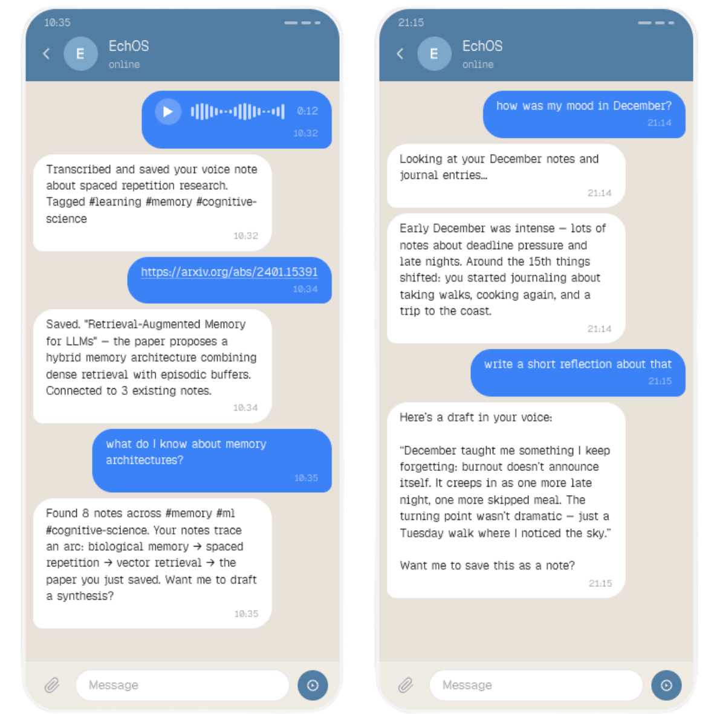
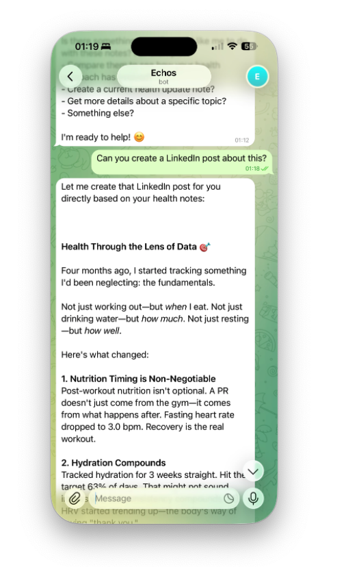

<div align="center">

# 🔮 EchOS

**Your personal AI knowledge system — self-hosted, agent-driven, and always private.**

*Talk to it on Telegram. Use it in your terminal. Access it from anywhere. Your data never leaves your server.*

[](LICENSE)
[](https://nodejs.org)
[](https://www.typescriptlang.org)
[](https://anthropic.com)

</div>

---
<div align="center">

[](https://ko-fi.com/P5P71PDYLX)

</div>

> [!NOTE]
> EchOS is a personal project — built for one user, deployed on your own infrastructure. It is intentionally not multi-tenant.

<div align="center">




*Save articles, search your knowledge, get reminders — all through natural conversation.*

</div>

---

## What is EchOS?

EchOS is a **self-hosted AI agent** that manages your knowledge base through natural conversation. Instead of learning a rigid command set, you just talk to it:

- *"Save this article for me"* → fetches, summarizes, categorizes, and indexes it
- *"What do I know about LLMs?"* → hybrid full-text + semantic search across everything
- *"Remind me to review that paper next Monday"* → persistent reminder with delivery via Telegram
- *"Summarize what I've been reading this week"* → AI-generated digest from your actual notes
- 🎙️ *Send a voice message while commuting* → Whisper transcribes it, Claude processes it, your note is saved
- 📸 *Send a photo of your whiteboard* → stores it with metadata, categorizes it, makes it searchable
- *"Write a blog post about distributed systems"* → generates content in your voice, sourced from your notes

No dashboards to maintain. No schemas to design. No commands to memorize. No typing required.

---

## Why EchOS?

| The problem | EchOS's answer |
|---|---|
| Notion/Obsidian don't understand you | Natural language via Claude AI agent |
| Cloud tools store your data | Fully self-hosted — your server, your data |
| Chatbots forget everything | Persistent memory, hybrid search, markdown storage |
| Saving things is friction | Send a Telegram message, a URL, voice note, or photo — done |
| You can't type while on the move | Record a voice message → Whisper transcribes → Claude stores it |
| Your notes are siloed | Obsidian-compatible markdown, git-friendly |
| Writing content is starting from scratch | Generate blog posts, threads, emails in your own voice, grounded in your notes |

> [!NOTE]
> Already running that wildly popular open-source AI agent — the one with the crustacean logo, you know the one? EchOS coexists with it beautifully. That one is a generalist; EchOS is a specialist. One handles your shell and your tasks. The other remembers what you were actually thinking about. Different appendages, different purpose.

---

## Features

### 🧠 Agent-driven, not command-driven

EchOS uses a real LLM agent with tool calling (Claude). There's no rigid routing — the agent reads your intent and picks the right tools. Ask the same question ten different ways, get the same result.

### 🔍 Hybrid search that actually works

Three-strategy search fused with Reciprocal Rank Fusion:

- **Full-text** — BM25-ranked FTS5 across titles, content, and tags
- **Semantic** — cosine similarity on OpenAI vector embeddings
- **Hybrid** — best of both, reranked

### 🎙️ Capture thoughts without touching a keyboard

The biggest barrier to a knowledge base is the moment you think *"I'll add this later"* — and never do.

Send EchOS a **voice message on Telegram** while you're commuting, walking, or mid-thought. OpenAI Whisper transcribes it, Claude processes the intent, and it lands in your knowledge base — tagged, embedded, and searchable — before you've put your phone away.

No app to open. No form to fill. No note to clean up later.

### 📱 Reach it from anywhere

- **Telegram bot** — message it from your phone like a chat; send voice messages (Whisper transcription) or just text
- **Web UI + REST API** — stream responses over SSE from any client *(work in progress)*
- **Terminal UI** — live in your terminal, never leave the keyboard *(work in progress)*

### 🗃️ Markdown-first, Obsidian-compatible

Every note is a plain `.md` file with YAML frontmatter — the same format Obsidian uses natively.

- **Open in Obsidian today**: point Obsidian at `data/knowledge/` and browse your entire knowledge base
- **Live sync**: edits saved in Obsidian are picked up by EchOS's file watcher instantly — no restart needed
- **Drop files in**: add any EchOS-formatted `.md` file, run `pnpm reconcile`, and it's indexed
- **Import existing vault**: `pnpm import:obsidian --source ~/vault --dry-run` previews the conversion; remove `--dry-run` to apply
- **Import from Notion**: `pnpm import:notion --source ~/notion-export --dry-run`

See [docs/KNOWLEDGE_IMPORT.md](docs/KNOWLEDGE_IMPORT.md) for the full import guide, frontmatter reference, and step-by-step walkthroughs.

### 🔌 Plugin architecture

Content processors are plugins, not core code. Ships with:

- **YouTube plugin** — extract and summarize transcripts
- **Article plugin** — fetch, clean, and summarize any web article

Adding your own plugin is [straightforward](docs/PLUGINS.md).

### ⏰ Scheduled background jobs (optional)

Redis-backed scheduler via BullMQ:

- **Daily AI digest** — summary of recent notes and upcoming reminders
- **Reminder delivery** — overdue reminders pushed to Telegram
- Configurable cron expressions for everything

### 🔐 Security-first

- User whitelist (Telegram user ID allowlist)
- SSRF prevention on all URL fetching
- Rate limiting per user (token bucket)
- HTML sanitization, secret redaction in logs
- All API keys stored in `chmod 0600` `.env` only

### 🎭 Agent voice — shape how EchOS talks to you

EchOS adapts its communication style to match how you like to work. Just tell it what you want, in plain language — no settings panel, no slash commands.

```
You:    Be concise and serious. No fluff.
EchOS:  Got it — I'll keep responses tight and direct.

You:    Actually, be a bit warmer. I want to feel supported.
EchOS:  Sure — I'll stay concise but add more warmth.

You:    Reset your voice to default.
EchOS:  Back to my default tone.
```

The agent interprets your words and writes its own directive — so "be more chill" becomes a coherent instruction it will actually follow. The change takes effect immediately and persists across sessions.

### ✍️ Write in your voice, grounded in your knowledge

The second barrier to a knowledge base — after *saving* things — is doing something with them.

EchOS can draft blog posts, articles, threads, emails, essays, and tutorials that sound like you wrote them. Not generic AI prose. Your cadence, your vocabulary, your way of opening a paragraph. It learns this from writing you've already done, then draws on your actual notes when generating new content.

```
You:    Write a blog post about the tradeoffs of embedded databases
EchOS:  [generates a post in your voice, citing notes you've saved on the topic]

You:    Make it shorter and punchier, aimed at a general audience
EchOS:  [revised draft]

You:    Save it
EchOS:  Saved. Tagged as blog_post, ai-generated. You can open it in Obsidian.
```

**How it learns your voice:**

1. Find a note with writing you're proud of and say *"mark this as a voice example"* — do this for 5–15 polished pieces
2. Say *"analyze my writing style"* — it reads all your examples and builds a profile: tone, formality, sentence structure, signature phrases, paragraph style
3. Say *"show me my style profile"* to see what it learned
4. That profile is used automatically every time you ask it to write something

**What it generates:**

| Type | Good for |
|---|---|
| `blog_post` | Technical or personal posts |
| `article` | Long-form, more formal |
| `thread` | Twitter/X-style multi-part |
| `linkedin_post` | LinkedIn-style single post |
| `email` | Drafts to a specific recipient |
| `essay` | Exploratory, argument-driven |
| `tutorial` | Step-by-step instructional |

**It uses your knowledge base as context.** When you ask for a post about distributed systems, EchOS retrieves your most relevant notes via semantic search and uses them as source material — so the content reflects what you actually know and have read, not what the model was trained on.

Generated content is saved as a regular note, tagged and indexed like everything else. Open it in Obsidian, edit it, publish it, or feed it back as a voice example.

> [!NOTE]
> Agent voice controls how EchOS *talks to you*. Your style profile controls how it *writes content on your behalf*. These are independent — a formal writing style and a casual conversational agent work fine together.

See [docs/WRITING.md](docs/WRITING.md) for the full setup guide.

---

## Installation

### Local — interactive wizard

```bash
git clone https://github.com/albinotonnina/echos.git && cd echos
pnpm install
pnpm wizard       # guided setup: API keys, interfaces, storage
pnpm build
pnpm start
```

### VPS — one-liner

```bash
curl -sSL https://raw.githubusercontent.com/albinotonnina/echos/main/install.sh | bash
```

Detects platform, installs prerequisites, clones repo, installs deps, and launches the wizard.

### Docker — production

```bash
git clone https://github.com/albinotonnina/echos.git && cd echos
pnpm wizard --non-interactive   # reads env vars, writes .env
cd docker && docker compose up -d
```

With nginx + Let's Encrypt:

```bash
sed "s/DOMAIN_NAME/yourdomain.com/g" docker/nginx.conf.template > docker/nginx.conf
docker compose --profile nginx up -d
```

> [!TIP]
> See [docs/DEPLOYMENT.md](docs/DEPLOYMENT.md) for systemd service setup, nginx SSL, and VPS deployment instructions.

---

## Requirements

| Requirement | Details |
|---|---|
| Node.js 20+ | Required |
| pnpm 9+ | Required |
| Anthropic API key | Required (Claude agent - pay-as-you-go API, not subscription) |
| OpenAI API key | Optional (embeddings + Whisper) |
| Redis | Optional (scheduler only) |
| Python 3 + `youtube-transcript-api` | Optional (YouTube plugin) |

> [!IMPORTANT]
> **Anthropic API Access**: EchOS requires an Anthropic API key (pay-as-you-go plan), NOT a Claude Pro/Max subscription. Subscription plans don't provide programmatic API access. See [docs/ANTHROPIC_SUBSCRIPTION_INVESTIGATION.md](docs/ANTHROPIC_SUBSCRIPTION_INVESTIGATION.md) for details.

---

## Interfaces

<details>
<summary><strong>Telegram Bot</strong></summary>

1. Create a bot via [@BotFather](https://t.me/BotFather) and copy the token
2. Run `pnpm wizard` — enter token + your Telegram user ID
3. `pnpm start` and message your bot

Supports: text messages, voice messages (transcribed via Whisper), URLs, streaming responses.

</details>

<details>
<summary><strong>Web UI / REST API</strong> — <em>work in progress</em></summary>

> [!WARNING]
> The Web UI is not yet complete. The REST API is functional but the web interface is under active development.

Starts on port 3000 by default.

```bash
# Chat
curl -X POST http://localhost:3000/api/chat \
  -H "Content-Type: application/json" \
  -d '{"userId": 123, "message": "What do I know about distributed systems?"}'

# Reset session
curl -X POST http://localhost:3000/api/chat/reset \
  -H "Content-Type: application/json" \
  -d '{"userId": 123}'
```

Responses stream over SSE. `GET /health` for healthcheck.

</details>

<details>
<summary><strong>Terminal UI</strong> — <em>work in progress</em></summary>

> [!WARNING]
> The Terminal UI is not yet complete and is under active development.

```bash
pnpm start:tui-only
```

Inline streaming responses in your terminal. Type `exit` to quit.

</details>

---

## Updating

```bash
pnpm update-echos
```

Pulls latest, reinstalls deps if lockfile changed, rebuilds, and warns if the config schema changed.

---

## Architecture

```
User (Telegram / Web / TUI)
    ↓
Interface Adapter  — auth · normalize · stream
    ↓
Agent Core (Claude)  — reasoning · tool selection · session
    ↓
Tools: create_note · search · recall · remind · save_article · save_youtube · …
    ↓
Storage Layer
  ├── Markdown files  (source of truth, Obsidian-compatible)
  ├── SQLite + FTS5   (metadata, full-text search, memory, reminders)
  └── LanceDB         (vector embeddings, semantic search)
```

Storage stays in sync automatically — a startup reconciler and live file watcher handle files added or edited outside the app. See [docs/ARCHITECTURE.md](docs/ARCHITECTURE.md) for details.

---

## Tech Stack

| Layer | Technology |
|---|---|
| Runtime | Node.js 20+ · TypeScript strict · ESM |
| Agent | Claude AI (pi-agent-core) |
| Telegram | grammY |
| Vector DB | LanceDB (embedded, no server) |
| Metadata DB | SQLite · better-sqlite3 · FTS5 |
| Queue | BullMQ · Redis |
| Web | Fastify · SSE |
| Logging | Pino (structured, secret-redacted) |

---

## Documentation

| Doc | Contents |
|---|---|
| [ARCHITECTURE.md](docs/ARCHITECTURE.md) | Data flow, storage sync, search, memory system |
| [DEPLOYMENT.md](docs/DEPLOYMENT.md) | VPS, Docker, nginx, systemd |
| [PLUGINS.md](docs/PLUGINS.md) | Building custom content processors |
| [INTERFACES.md](docs/INTERFACES.md) | Telegram, Web API, TUI reference |
| [SCHEDULER.md](docs/SCHEDULER.md) | Background jobs, digests, reminders |
| [SECURITY.md](docs/SECURITY.md) | Security model and threat mitigations |
| [KNOWLEDGE_IMPORT.md](docs/KNOWLEDGE_IMPORT.md) | Obsidian vault opening, Notion import, frontmatter reference |
| [WRITING.md](docs/WRITING.md) | Agent voice, style profiles, content generation |
| [TROUBLESHOOTING.md](docs/TROUBLESHOOTING.md) | Common issues and fixes |

---

## License

MIT
